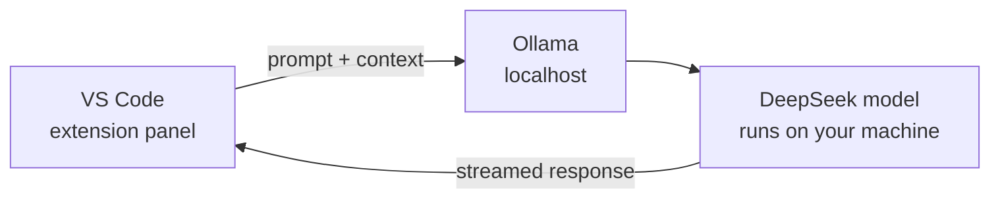

# DeepSeek for VS Code (unofficial)

An unofficial VS Code extension that puts DeepSeek's models inside your editor — chat with the model about your code, powered locally through Ollama, so nothing you write leaves your machine.

**Site:** <https://deepseek-extension.vercel.app>

When DeepSeek's open models landed, the obvious question was: why send code to a cloud API when the model runs happily on your own hardware? This extension wires DeepSeek (served by Ollama) into a VS Code panel, giving you a local, private AI assistant with zero API bills.

## How it works


```mermaid
flowchart LR
    VS["VS Code<br/>extension panel"] -- "prompt + context" --> OL["Ollama<br/>localhost"]
    OL --> DS["DeepSeek model<br/>runs on your machine"]
    DS -- "streamed response" --> VS
```

The extension talks to Ollama's local API. Your prompts, your code and the model's answers all stay on `localhost`.

## Setup

1. Install [Ollama](https://ollama.com) and pull a DeepSeek model:

   ```bash
   ollama pull deepseek-r1
   ```

2. Install the extension from the VS Code Marketplace (search "DeepSeek").
3. Open the DeepSeek panel and start asking.

## Features

- Chat with DeepSeek about your code from a sidebar panel
- Fully local inference via Ollama — private by architecture, free by consequence
- Works offline once the model is pulled

## Honest limitations

- Local inference speed depends entirely on your hardware; a laptop without a decent GPU will feel it
- This is an unofficial community extension, unaffiliated with DeepSeek the company
- It is a chat assistant, not an autocomplete engine — it does not replace Copilot-style inline completions

## Stack

TypeScript · VS Code Extension API · Ollama · DeepSeek

---

Built by [Aryan S Rao](https://github.com/aryansrao). MIT. Issues and pull requests are welcome.
