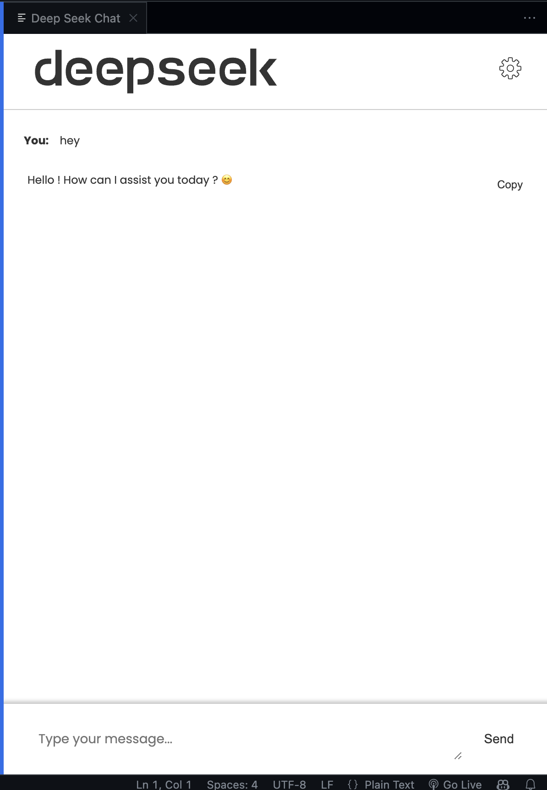

<h1>DeepSeek AI Assistant</h1>

<h3>Your Local AI Programming Assistant for VS Code</h3>

[](https://marketplace.visualstudio.com/items?itemName=aryansrao.deekseek-extension)

[](https://marketplace.visualstudio.com/items?itemName=aryansrao.deekseek-extension)

[](LICENSE)

## Screenshots

<div align="center">
<table>
<tr>
<td width="50%">

<p align="center"><em>DeepSeek Chat Interface - Dark</em></p>
</td>
<td width="50%">

<p align="center"><em>DeepSeek Chat Interface - Light</em></p>
</td>
</tr>
</table>
</div>

> 💡 **Pro tip**: Use `Cmd/Ctrl + Shift + P` and type "start" to begin

##  Quick Setup

# 1. Install Ollama

visit https://ollama.com

# 2. Pull DeepSeek Model

```
ollama run deepseek-r1
```
Visit https://ollama.com/library/deepseek-r1 for more info.

# 3. Install Extension

```
code --install-extension aryansrao.deekseek-extension
```
### OR

visit https://marketplace.visualstudio.com/items?itemName=aryansrao.deekseek-extension 

## What It Does
DeepSeek brings powerful AI assistance directly into VS Code, running completely locally through Ollama:

-  **Code Generation** - Get intelligent code suggestions

-  **Real-time Help** - Ask questions about your code

-  **Documentation** - Generate comments and documentation

-  **Debugging** - Get help fixing bugs

-  **Best Practices** - Learn coding patterns and improvements

## Requirements

- VS Code 1.96+

- MacOS/Linux/Windows

- [Ollama](https://ollama.com) installed

## Troubleshooting

**Extension Not Working?**

1. Verify Ollama is running:

2. Check model is downloaded: `ollama list`

3. Restart VS Code


## Resources

- [Link to the extension](https://marketplace.visualstudio.com/items?itemName=aryansrao.deekseek-extension)

- [Issue Tracker](https://github.com/aryansrao/deepseek-extension/issues)

- [Ollama Docs](https://ollama.com/docs)

## Contributing

Contributions are welcome!


